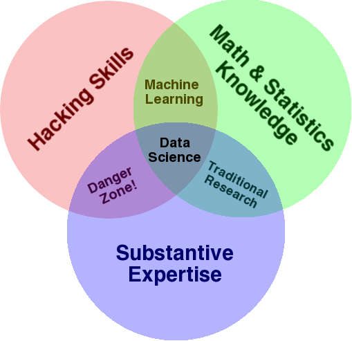
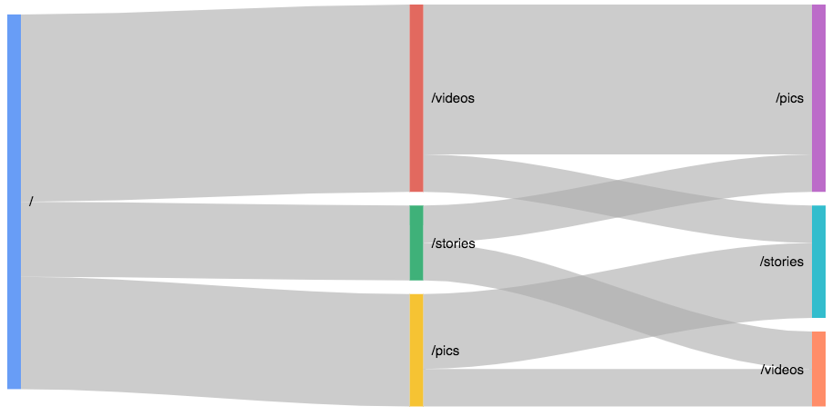
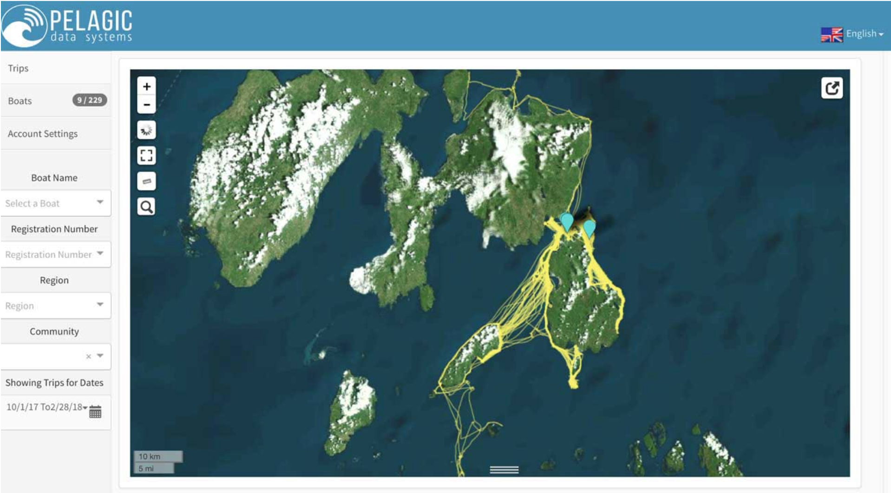
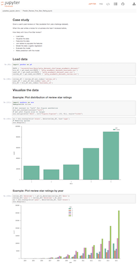
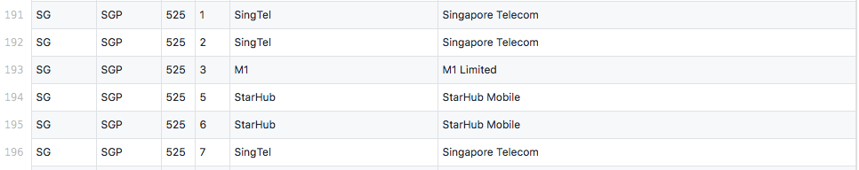

### Quick primer on data science
*JuniorDevSG, October 15 2018*

Oliver Chen, TRA, oliver@tra.sg

---

## Overview

* What is data science?
* Standard approach
* Developer approach
* Shameless pitch

---

## Warning!

My advice is opinionated and non-standard

Your mileage may vary

---

## What is data science?

---

### Applications in e-commerce

* Recommendation engines
* Nudge customers to more frequent/higher value purchases

---

### An application for web devs

* Javascript bundles are getting larger and larger 
* Code-split to avoid large initial load times
* How to decide where to split and what to pre-fetch?

---

## Google Analytics data

---

## Guess.js

* https://blog.mgechev.com/2018/03/18/machine-learning-data-driven-bundling-webpack-javascript-markov-chain-angular-react/
* https://github.com/guess-js/guess (Alpha)

---

### DataKind work with Pelagic Data Systems

---

### What TRA has been doing

* Consultants to one of the world's largest consumer electronics manufacturer
* Working with its South-East Asia and Oceania and Middle East North Africa regional HQs
* Focus on marketing

---

## Standard approach - notebooks

http://nbviewer.jupyter.org/github/xun-tang/pyladies_jupyter_demo/blob/master/Predict_Review_Five_Star_Rating.ipynb

---

## Issues with notebooks

* Notebooks are defined as JSON files. Doesn't show up well in Github
* Hard to have modular code (though that's getting better)
* Hard to have unit tests

---

### Standard approach – team hierarchy

* Data engineers engineer the data ...
* ... for the data scientists who science the data into a model ...
* ... for the data engineers to engineer the model into production

---

### Developer approach

* Machine learning libraries are becoming easier to use at scale
* Convergence of data engineers and scientists is analogous to DevOps
* Unit tests!

---

### Shameless pitch: source control for data 

* Github has become the standard platform for collaboration on code
* Why is there no platform for collaboration on data?
* Why not use Github for data collaboration?

---

## MCC/MNC

---

### Data on Github

* Data diffs are not the same as code diffs
* In many cases, data needs to be visualised for anybody to get a sense of it
* Github is too high a technical bar for people who work with data

---

### Applications for Github for data

* Data journalism
* Reproducible research
* Crowd-sourced datasets

---

### Thank you!

We're hiring! hr@tra.sg

